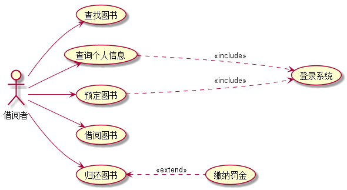
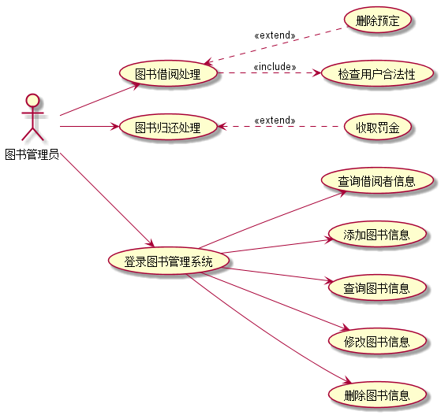
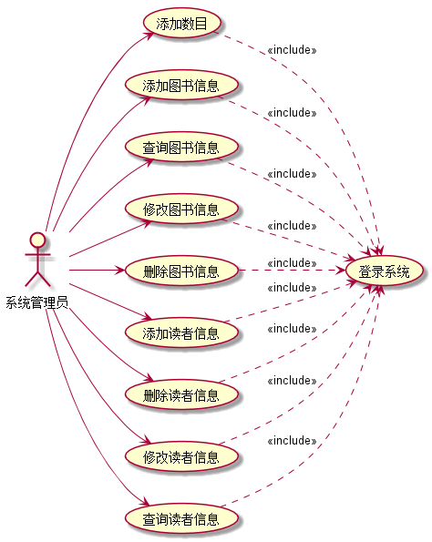

# 实验2：图书管理系统用例建模
|学号|班级|姓名|照片|
|:-------:|:-------------: | :----------:|:---:|
|201510414122|软件(本)15-1|吴川||

## 1. 图书管理系统的用例关系图

### 1.1 借阅者用例图PlantUML源码如下：

``` usecase
@startuml
:借阅者: as Borrower
left to right direction
Borrower -->(查找图书)
Borrower -->(查询个人信息)
Borrower -->(预定图书)
Borrower -->(借阅图书)
Borrower -->(归还图书)
(归还图书)<..(缴纳罚金):<<extend>>
(查询个人信息)...>(登录系统):<<include>>
(预定图书)...>(登录系统):<<include>>
@enduml
```

### 1.2. 借阅者用例图如下：




 
### 1.3. 图书管理员用例图PlantUML源码如下：
 
``` usecase
@startuml
:图书管理员: as admin
left to right direction
admin-->(图书借阅处理)
admin-->(图书归还处理)
admin-->(登录图书管理系统)
(登录图书管理系统)-->(查询借阅者信息)
(登录图书管理系统)-->(添加图书信息)
(登录图书管理系统)-->(查询图书信息)
(登录图书管理系统)-->(修改图书信息)
(登录图书管理系统)-->(删除图书信息)
(图书借阅处理)<..(删除预定):<<extend>>
(图书借阅处理)..>(检查用户合法性):<<include>>
(图书归还处理)<..(收取罚金):<<extend>>
@enduml
```

### 1.4. 图书管理员用例图如下：





### 1.5. 系统管理员用例图PlantUML源码如下：
 
``` usecase
@startuml
:系统管理员: as ad
left to right direction
ad-->(添加数目)
ad-->(添加图书信息)
ad-->(查询图书信息)
ad-->(修改图书信息)
ad-->(删除图书信息)
ad-->(添加读者信息)
ad-->(删除读者信息)
ad-->(修改读者信息)
ad-->(查询读者信息)
(添加数目)..>(登录系统):<<include>>
(添加图书信息)..>(登录系统):<<include>>
(查询图书信息)..>(登录系统):<<include>>
(修改图书信息)..>(登录系统):<<include>>
(删除图书信息)..>(登录系统):<<include>>
(添加读者信息)..>(登录系统):<<include>>
(删除读者信息)..>(登录系统):<<include>>
(修改读者信息)..>(登录系统):<<include>>
(查询读者信息)..>(登录系统):<<include>>
@enduml
```


### 1.6. 系统管理员用例图如下：





## 2. 参与者说明：

###     2.1 读者
 
主要职责是：
* 将读者借书卡提供给图书管理员；
* 查询图书信息；
* 借阅图书；
* 将图书归还给图书管理员。
 
###     2.2 图书管理员
 
主要职责是：
* 将读者借书卡提供给图书管理系统；
* 将图书编号和书号输入系统
* 对图书管理系统里的图书数目进行添加，查询，修改和删除操作；
* 收取图书损坏或遗失的罚金。
           
###     2.3 系统管理员
    
主要职责是：
* 对读者信息进行添加，查询，修改和删除操作；
* 对图书管理系统里的图书数目进行添加，查询，修改和删除操作；
* 定时维护和检查图书管理系统。
           
           
##     3. 用例规约表

###     3.1 “借出图书”用例


:-:|:-:
用例名称 | 啊

###     3.2 “购入图书”用例

参见：表7.5

**“购入图书”用例流程图源码如下：**
``` uc1_flow
@startuml
start
:Hello world;
:This is on defined on
several **lines**;
stop
@enduml
```

**“购入图书”用例流程图源码如下：**


###     3.3 “***”用例

参见：表7.5
